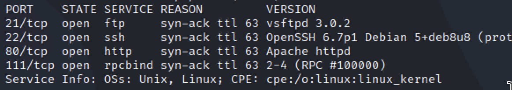
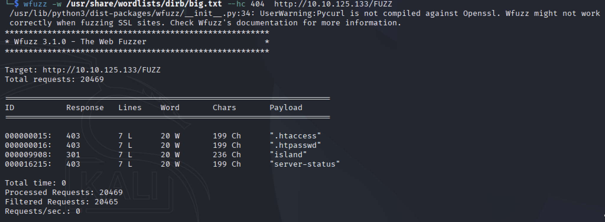
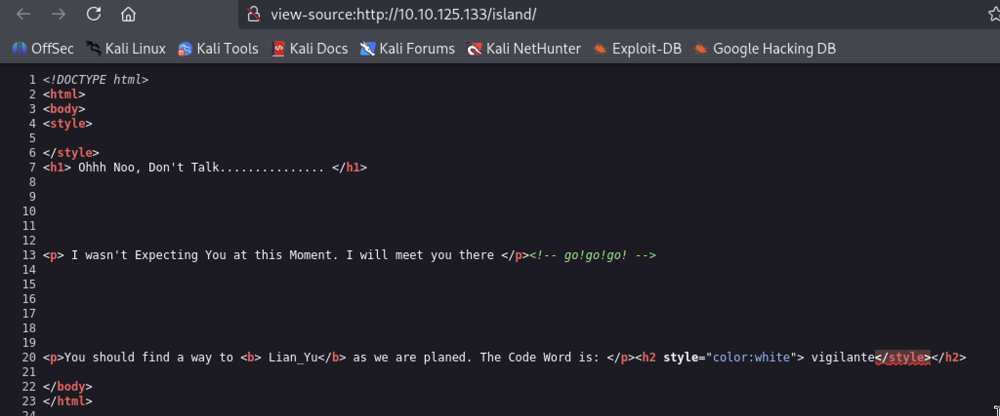
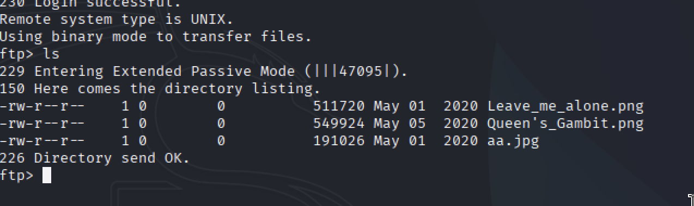
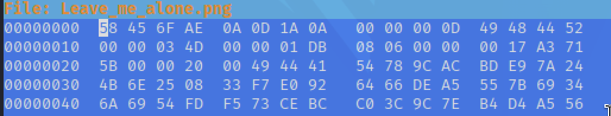
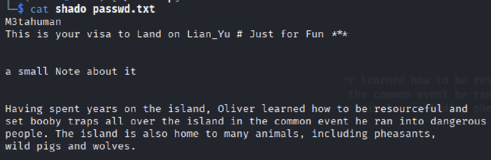
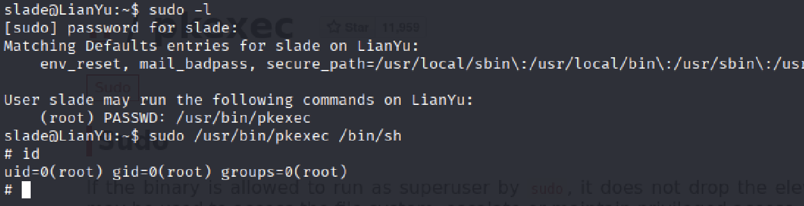

# Lian-Yu CTF (TryHackMe)


## Port Scan via Nmap


Let's look up open ports on the machine.

```bash
sudo nmap <machine-ip> -sV -vv 
```





## Directory Enumeration
As we are seeing HTTP run on port 80. We should scan directories.



```bash

wfuzz -w /us/share/wordlist/dirb/big.txt --hc 404 http://<machine-ip>/FUZZ
```

We've found the */island* directory.





Page says The Code Word is **vigilante**. I did take note of that. Apparently, we're gonna use it somewhere. And I am keeping scanning, but I've decided to use *Gobuster* instead of ***Wfuzz***. Finally, I found the first question! 2***.


When we're looking at the page source. It makes mention that there is a **"ticket"**.


```bash
wfuzz -w /usr/share/wordlist/dirb/directory-list-1.0.txt   http://<machine-ip>/island/2100/FUZZ.ticket
```


And we are finding a hash in gr!'^+_a'^!'@+.ticket. The hash is "R!&'%%&!?@". I think the hash seems like a Base. And I am understanding it's ***Base58*** encoding.


## FTP Login


Next Step! It's time to use the code "vigilante" word with the hash I decoded at the FTP Server.


```bash 
ftp vigilante@<machine-ip>
```





## JPGE & Hex Signature

I am downloading all files in FTP server. And one of them seems broken. And I want to check via hexeditor tool. It's happening as I thought! *58 45 6F AE 0A 0D 1A 0A* it's not the correct Magic Number for a [PNG](https://en.wikipedia.org/wiki/PNG) file. It has to be *89 50 4e 47 0d 0a 1a 0a*.





## Steganography


The picture says **the password is password**. What should be for this password? I am realising that it must be *steganography* after thinking for a while. I am finding two TXT files inside this JPG file.


```bash
steghide extract -sf aa.jpg
```


```bash
shadow.txt
passwd.txt
```





The character name shown in the aa.jpg is ***slade***. I think that's our *SSH* username! 

```bash
ssh slade@<machine-ip>
```

## Privilege Escalation

After I get the **"user.txt"**. I want to check *sudo* permissions. And I see the command ***/bin/pkexec*** can be used by user *Slade* as sudo! We do privilege escalation using this **sudo** permission!</p>


